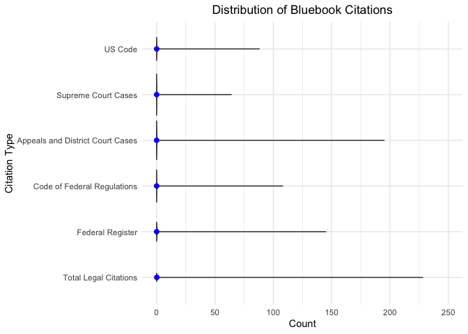

## Citation Sources

This file is based on three documents: Georgetown's Bluebook style for US code, Supreme Court, and Appeals and District Courts <https://guides.ll.georgetown.edu/c.php?g=261289&p=2339383>, Cornell's Bluebook guide for the CFR and the Federal Register <https://www.law.cornell.edu/citation/2-400#:~:text=Principle%201%3A%20The%20core%20of,followed%20by%20a%20space%20%C2%ABe.g.%C2%BB> and a Github which lists many regex ideas for legal citations <https://gist.github.com/mlissner/dda7f6677b98b98f54522e271d486781>


```r
US_Code_Regex <- "\\d{1,2}\\s{0,1}[Uu]\\.{0,1}[Ss]\\.{0,1}[Cc]\\.{0,1}\\s{0,}\\§{0,1}\\s{0,}\\d{1,}(\\s{0,}\\(\\d{4}\\))?"
Supreme_Court_Cases <- "[A-z]{3,}(\\.)?\\s{1,}v\\.{0,1}\\s{1,}[A-z]{3,}(,)?\\s{1,}\\d{1,}\\s{1,}[Uu]\\.{0,1}\\s{0,}[Ss]\\.{0,1}"
Appeals_and_District_Court_Cases <- "[A-z]{3,}(\\.)?\\s{1,}v\\.{0,1}\\s{1,}[A-z]{3,}(,)?\\s{1,}\\d{1,}\\s{1,}[Ff]"
Code_of_Federal_Regulations <- "\\d{1,}\\s{0,}[Cc].{0,1}\\s{0,}[Ff].{0,1}\\s{0,}[Rr].{0,1}\\s{0,}\\§{0,1}\\s{0,}\\d{1,}" 
Federal_Register <- "\\d{1,}\\s{0,}Fed\\.{0,1}\\s{1,}Reg\\.{0,1}\\s{0,}\\d{1,}"
```

Now we can show the Regex works on toy cites.


```r
# US Code Regex - Permissible 
str_count(string =  "14 USC § 25, 14 USC 25, 14 U.S.C. 25, 14 USC 25 (2005), 
          14 U.SC 25, 14USC25", 
          pattern = US_Code_Regex)
```

```
## [1] 6
```

```r
# Supreme Court
str_count(string =  "Roe v. Wade, 410 U.S. 113, 164 (1973), 
          Roe v. Wade, 410 U.S. 113,
          Roe v Wade, 410 U.S. 113,
          Roe v Wade 410 U.S. 113,
          Roe v Wade 410 US 113",
          pattern = Supreme_Court_Cases)
```

```
## [1] 5
```

```r
str_count(string =  "Universal City Studios, Inc. v. Corley, 273 F.3d 429 (2d Cir. 2001),
          Universal City Studios, Inc. v. Corley, 273 F.3d 429,
          Universal City Studios, Inc. v. Corley, 273 F.d 429,
          Universal City Studios, Inc. v. Corley, 273 F.", 
          pattern = Appeals_and_District_Court_Cases)
```

```
## [1] 4
```

```r
str_count(string =  "20 C.F.R. § 404.260,
          20 C.F.R. § 404,
          20 CFR § 404.260
          20 CFR § 404", 
          pattern = Code_of_Federal_Regulations)
```

```
## [1] 4
```

```r
str_count(string =  "59 Fed. Reg. 4233,
          59 Fed. Reg. 4233", 
          pattern = Federal_Register)
```

```
## [1] 2
```

Now we can show that the regular expressions work in practice on a random sample of five documents that have examples of the citation we care about.


```r
# show random examples in practice
show_regex_works <- function(pattern, num_to_print){
  FR <- str_count(string = attachments$attachment_text, pattern = pattern)
  return(str_match_all(string = attachments$attachment_text[which(FR>0)], 
                pattern = pattern) %>%
    sample(num_to_print,replace = F))
}

show_regex_works(US_Code_Regex, 5)
```

```
## [[1]]
##      [,1]             [,2]
## [1,] "12 U.S.C. 1701" NA  
## [2,] "12 U.S.C. 1701" NA  
## [3,] "12 U.S.C. 1701" NA  
## [4,] "12 U.S.C. 1701" NA  
## 
## [[2]]
##      [,1]               [,2]
## [1,] "15 U.S.C. § 1640" NA  
## [2,] "15 U.S.C. § 1640" NA  
## [3,] "15 U.S.C. § 1640" NA  
## 
## [[3]]
##      [,1]               [,2]
## [1,] "12 U.S.C. 1701"   NA  
## [2,] "12 U.S.C. § 5511" NA  
## [3,] "12 U.S.C. § 5511" NA  
## [4,] "12 U.S.C. § 5511" NA  
## 
## [[4]]
##       [,1]                  [,2]
##  [1,] "15 U.S.C. §1691"     NA  
##  [2,] "15 U.S.C. §1691"     NA  
##  [3,] "15 U.S.C. §1691"     NA  
##  [4,] "15 U.S.C. § 1691"    NA  
##  [5,] "15 U.S.C. §1691"     NA  
##  [6,] "15 U.S.C. §1691"     NA  
##  [7,] "15 U.S.C. \n\n§1691" NA  
##  [8,] "15 U.S.C. §1691"     NA  
##  [9,] "15 U.S.C. §1691"     NA  
## [10,] "15 U.S.C. §1601"     NA  
## [11,] "15 U.S.C. §1640"     NA  
## [12,] "15 U.S.C. §1601"     NA  
## 
## [[5]]
##       [,1]                [,2]
##  [1,] "15 U.S.C.  § 1012" NA  
##  [2,] "12 U.S.C. §5481"   NA  
##  [3,] "12 U.S.C. §5481"   NA  
##  [4,] "12 U.S.C. 5481"    NA  
##  [5,] "12 U.S.C. 5517"    NA  
##  [6,] "12 U.S.C. §5517"   NA  
##  [7,] "10 U.S.C. §987"    NA  
##  [8,] "10 U.S.C. §987"    NA  
##  [9,] "12 U.S.C. §5517"   NA  
## [10,] "10 U.S.C. §987"    NA  
## [11,] "18 U.S.C. § 1962"  NA  
## [12,] "18 U.S.C. § 1961"  NA  
## [13,] "15 U.S.C. § 1601"  NA  
## [14,] "15 U.S.C. §1606"   NA  
## [15,] "15 U.S.C. §1605"   NA  
## [16,] "15 U.S.C. §1605"   NA  
## [17,] "15 U.S.C. § 1605"  NA  
## [18,] "15 U.S.C. §1601"   NA  
## [19,] "10 U.S.C. § 987"   NA  
## [20,] "5 U.S.C. § 706"    NA
```

```r
show_regex_works(Supreme_Court_Cases, 5)
```

```
## [[1]]
##      [,1]                          [,2] [,3]
## [1,] "Corp. v. Bonjorno, 494 U.S." "."  "," 
## 
## [[2]]
##      [,1]                            [,2] [,3]
## [1,] "Hines v. Davidowitz, 312 U.S." NA   "," 
## 
## [[3]]
##       [,1]                                   [,2] [,3]
##  [1,] "States  v.  Perez,  402  U.S."        NA   "," 
##  [2,] "Mullaney  v.  Wilbur,  421  U.S."     NA   "," 
##  [3,] "States v.  Park,  421  U.S."          NA   "," 
##  [4,] "Marbury  v.  Brooks,  20  U.S."       NA   "," 
##  [5,] "States  v.  Nobles,  422  U.S."       NA   "," 
##  [6,] "McCray  v.  Illinois,  386  U.S."     NA   "," 
##  [7,] "States  v.  Simmons,  96  U.S."       NA   "," 
##  [8,] "Barker  v.  Wingo,  407  U.S."        NA   "," 
##  [9,] "Vogel  v.  Gruaz,  110  U.S."         NA   "," 
## [10,] "Hale  v.  Henkel,  201  U.S."         NA   "," 
## [11,] "Brown  v.  Walker,  161  U.S."        NA   "," 
## [12,] "Barber  v.  Page,  390  U.S."         NA   "," 
## [13,] "Griffin  v.  California,  380  U.S."  NA   "," 
## [14,] "Lakeside  v.  Oregon,  435  U.S."     NA   "," 
## [15,] "Barber  v.  Page,  390  U.S."         NA   "," 
## [16,] "Green  v.  California,  399  U.S."    NA   "," 
## [17,] "Dutton  v.  Evans,  400\nU.S."        NA   "," 
## [18,] "California  v.  Green,  399  U.S."    NA   "," 
## [19,] "Dutton  v.  Evans,  400  U.S."        NA   "," 
## [20,] "nia  v.  Green,  399  U.S."           NA   "," 
## [21,] "California  v.  Green,  399  U.S."    NA   "," 
## [22,] "Dutton  v.  Evans,  400  U.S."        NA   "," 
## [23,] "Brookhart  v. Janis,  384  U.S."      NA   "," 
## [24,] "Johnson  v.  Zerbst,  304  U.S."      NA   "," 
## [25,] "Williams  v.  Oklahoma,  358  U.S."   NA   "," 
## [26,] "Illinois  v.  Allen,  397  U.S."      NA   "," 
## [27,] "Snyder v.\nMassachusetts,  291  U.S." NA   "," 
## [28,] "Brookhart  v.  Janis,  384  U.S."     NA   "," 
## [29,] "States  v.  Hale,  422  U.S."         NA   "," 
## 
## [[4]]
##      [,1]                                [,2] [,3]
## [1,] "Oelrichs  v.  Spain,  82  U.S."    NA   "," 
## [2,] "Day\nv.  Woodworth,  54  U.S."     NA   "," 
## [3,] "Arcambel  v.  Wiseman,  3  U.S."   NA   "," 
## [4,] "Oelrichs\n\nv.  Spain,  82  U.S."  NA   "," 
## [5,] "Oelrichs  v.  Spain,  82 U.S."     NA   "," 
## [6,] "Stewart  v.  Sonneborn,  98  U.S." NA   "," 
## 
## [[5]]
##       [,1]                               [,2] [,3]
##  [1,] "States  v. Hayes,  555 U.S."      NA   "," 
##  [2,] "Jama  v. INS,  543 U.S."          NA   "," 
##  [3,] "Barnhart  v.  Thomas,  540 U.S."  NA   "," 
##  [4,] "Johnson  v. Sayre,  158 U.S."     NA   "," 
##  [5,] "Barnhart  v.  Thomas,  540 U.S."  NA   "," 
##  [6,] "States  v. Hayes,  555 U.S."      NA   "," 
##  [7,] "Dewsnap  v.  Timm, \n502 U.S."    NA   "," 
##  [8,] "States  v. Granderson,  511 U.S." NA   "," 
##  [9,] "Dewsnup  v.  Timm,  502 U.S."     NA   "," 
## [10,] "Dewsnap  v.  Timm, \n502 U.S."    NA   "," 
## [11,] "Gonzales  v. Oregon,  546 \nU.S." NA   "," 
## [12,] "Conroy  v. Aniskoff,  507 U.S."   NA   "," 
## [13,] "Texas v.  Timbers \n484 U.S."     NA   NA  
## [14,] "States  v. Alaska,  521 U.S."     NA   ","
```

```r
show_regex_works(Appeals_and_District_Court_Cases, 5)
```

```
## [[1]]
##      [,1]                           [,2] [,3]
## [1,] "Trax  v. NationsBank,  33  F" NA   "," 
## 
## [[2]]
##      [,1]                          [,2] [,3]
## [1,] "Eubank v. Pella, 753 F"      NA   "," 
## [2,] "Poertner v. Gillette, 618 F" NA   "," 
## 
## [[3]]
##      [,1]                      [,2] [,3]
## [1,] "Goldstein v. SEC, 451 F" NA   "," 
## 
## [[4]]
##      [,1]                   [,2] [,3]
## [1,] "Inc. v. Alig, 737 F"  "."  "," 
## [2,] "Prado v. Bush, 221 F" NA   "," 
## 
## [[5]]
##      [,1]                       [,2] [,3]
## [1,] "Corp. v. Williams, 62 F"  "."  "," 
## [2,] "Burtnick v. McLean, 76 F" NA   ","
```

```r
show_regex_works(Code_of_Federal_Regulations, 5)
```

```
## [[1]]
##      [,1]             
## [1,] "17 C.F.R. § 275"
## 
## [[2]]
##      [,1]             
## [1,] "12C.F.R. §  220"
## [2,] "17C.F.R. § 240" 
## 
## [[3]]
##      [,1]     
## [1,] "31cf-r5"
## 
## [[4]]
##      [,1]        
## [1,] "17 CFR 249"
## [2,] "17 CFR 249"
## [3,] "17 CFR 249"
## 
## [[5]]
##      [,1]           
## [1,] "12 CFR § 1002"
```

```r
show_regex_works(Federal_Register, 5)
```

```
## [[1]]
##      [,1]                  
## [1,] "76 Fed. Reg. 8946"   
## [2,] "75 Fed. Reg. 60287"  
## [3,] "47 Fed. Reg. 11380"  
## [4,] "70 Fed. Reg. \n44722"
## 
## [[2]]
##      [,1]                   
## [1,] "81  Fed.  Reg.  29169"
## [2,] "81  Fed.  Reg.  29172"
## 
## [[3]]
##      [,1]                   
## [1,] "76  Fed.  Reg.  27390"
## [2,] "76  Fed.  Reg.  27390"
## 
## [[4]]
##      [,1]                
## [1,] "79 Fed. Reg. 53422"
## 
## [[5]]
##      [,1]                   
## [1,] "75  Fed.  Reg.  77052"
## [2,] "75  Fed.  Reg.  77190"
```


```r
attachments %<>%
  mutate(
    US_Code = str_count(string = attachment_text,
                        pattern = US_Code_Regex),
    Supreme_Court_Cases = str_count(string = attachment_text,
                                    pattern = Supreme_Court_Cases),
    Appeals_and_District_Court_Cases = str_count(string = attachment_text,
                                                 pattern = Appeals_and_District_Court_Cases),
    Code_of_Federal_Regulations = str_count(string = attachment_text,
                                            pattern = Code_of_Federal_Regulations),
    Federal_Register_Total = str_count(string = attachment_text, 
                                        pattern = Federal_Register),
    Total_Legal_Citations = US_Code + Supreme_Court_Cases + 
      Appeals_and_District_Court_Cases + Code_of_Federal_Regulations +
      Federal_Register_Total
  ) 

#### Get stats for all citations

# Overall
DF_in_one_column <- attachments %>%
  select(-attachment_text, -attachment_number) %>%
  rename(
    `US Code` = US_Code,
    `Supreme Court Cases` = Supreme_Court_Cases,
    `Appeals and District Court Cases` = Appeals_and_District_Court_Cases,
    `Code of Federal Regulations` = Code_of_Federal_Regulations,
    `Federal Register` = Federal_Register_Total,
    `Total Legal Citations` = Total_Legal_Citations) %>%
  gather(Legal_Citation, val) %>% 
  mutate(val = as.numeric(val)) %>%
  filter(!is.na(val)) %>%
  group_by(Legal_Citation)
  
#' Show summary statistics for all technical features
knitr::kable(DF_in_one_column %>%
               summarise(n = n(),
                         min = fivenum(val)[1],
                         Q1 = fivenum(val)[2],
                         median = fivenum(val)[3],
                         Q3 = fivenum(val)[4],
                         Q90 = quantile(val, 0.9, na.rm = T),
                         Q95 = quantile(val, 0.95, na.rm = T),
                         Q99 = quantile(val, 0.99, na.rm = T),
                         max = fivenum(val)[5])) %>%
  kable_styling(bootstrap_options = c("striped", "hover"))
```

<table class="table table-striped table-hover" style="margin-left: auto; margin-right: auto;">
 <thead>
  <tr>
   <th style="text-align:left;"> Legal_Citation </th>
   <th style="text-align:right;"> n </th>
   <th style="text-align:right;"> min </th>
   <th style="text-align:right;"> Q1 </th>
   <th style="text-align:right;"> median </th>
   <th style="text-align:right;"> Q3 </th>
   <th style="text-align:right;"> Q90 </th>
   <th style="text-align:right;"> Q95 </th>
   <th style="text-align:right;"> Q99 </th>
   <th style="text-align:right;"> max </th>
  </tr>
 </thead>
<tbody>
  <tr>
   <td style="text-align:left;"> Appeals and District Court Cases </td>
   <td style="text-align:right;"> 88593 </td>
   <td style="text-align:right;"> 0 </td>
   <td style="text-align:right;"> 0 </td>
   <td style="text-align:right;"> 0 </td>
   <td style="text-align:right;"> 0 </td>
   <td style="text-align:right;"> 0 </td>
   <td style="text-align:right;"> 0 </td>
   <td style="text-align:right;"> 0 </td>
   <td style="text-align:right;"> 195 </td>
  </tr>
  <tr>
   <td style="text-align:left;"> Code of Federal Regulations </td>
   <td style="text-align:right;"> 88593 </td>
   <td style="text-align:right;"> 0 </td>
   <td style="text-align:right;"> 0 </td>
   <td style="text-align:right;"> 0 </td>
   <td style="text-align:right;"> 0 </td>
   <td style="text-align:right;"> 0 </td>
   <td style="text-align:right;"> 0 </td>
   <td style="text-align:right;"> 1 </td>
   <td style="text-align:right;"> 108 </td>
  </tr>
  <tr>
   <td style="text-align:left;"> Federal Register </td>
   <td style="text-align:right;"> 88593 </td>
   <td style="text-align:right;"> 0 </td>
   <td style="text-align:right;"> 0 </td>
   <td style="text-align:right;"> 0 </td>
   <td style="text-align:right;"> 0 </td>
   <td style="text-align:right;"> 0 </td>
   <td style="text-align:right;"> 0 </td>
   <td style="text-align:right;"> 2 </td>
   <td style="text-align:right;"> 145 </td>
  </tr>
  <tr>
   <td style="text-align:left;"> Supreme Court Cases </td>
   <td style="text-align:right;"> 88593 </td>
   <td style="text-align:right;"> 0 </td>
   <td style="text-align:right;"> 0 </td>
   <td style="text-align:right;"> 0 </td>
   <td style="text-align:right;"> 0 </td>
   <td style="text-align:right;"> 0 </td>
   <td style="text-align:right;"> 0 </td>
   <td style="text-align:right;"> 0 </td>
   <td style="text-align:right;"> 64 </td>
  </tr>
  <tr>
   <td style="text-align:left;"> Total Legal Citations </td>
   <td style="text-align:right;"> 88593 </td>
   <td style="text-align:right;"> 0 </td>
   <td style="text-align:right;"> 0 </td>
   <td style="text-align:right;"> 0 </td>
   <td style="text-align:right;"> 0 </td>
   <td style="text-align:right;"> 0 </td>
   <td style="text-align:right;"> 0 </td>
   <td style="text-align:right;"> 7 </td>
   <td style="text-align:right;"> 228 </td>
  </tr>
  <tr>
   <td style="text-align:left;"> US Code </td>
   <td style="text-align:right;"> 88593 </td>
   <td style="text-align:right;"> 0 </td>
   <td style="text-align:right;"> 0 </td>
   <td style="text-align:right;"> 0 </td>
   <td style="text-align:right;"> 0 </td>
   <td style="text-align:right;"> 0 </td>
   <td style="text-align:right;"> 0 </td>
   <td style="text-align:right;"> 2 </td>
   <td style="text-align:right;"> 88 </td>
  </tr>
</tbody>
</table>

Now show a violin plot 


```r
DF_in_one_column %>%
  mutate(Legal_Citation = factor(Legal_Citation, levels = c("US Code",
                        "Supreme Court Cases","Appeals and District Court Cases",
                        "Code of Federal Regulations", "Federal Register",
                        "Total Legal Citations"))) %>%
  ggplot(aes(y=val, x=forcats::fct_rev(factor(Legal_Citation)))) + 
  geom_violin(position="dodge", alpha=0.5) +
  theme_minimal() +
  coord_flip(ylim = c(0, 250)) +
  labs(title = "Distribution of Bluebook Citations") +
  theme(plot.title = element_text(hjust = 0.5)) +
  xlab("Citation Type") + ylab("Count") +
  stat_summary(fun=median, geom="point", size=2, color="red") +
  stat_summary(fun=mean, geom="point", size=2, color ="blue")
```

<!-- -->

