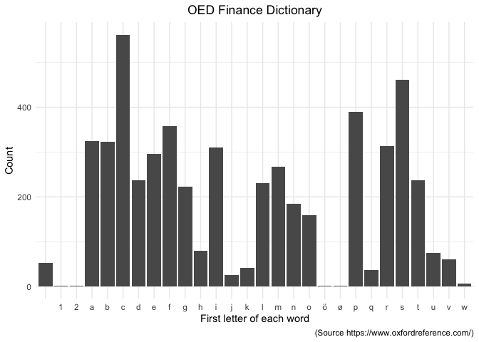
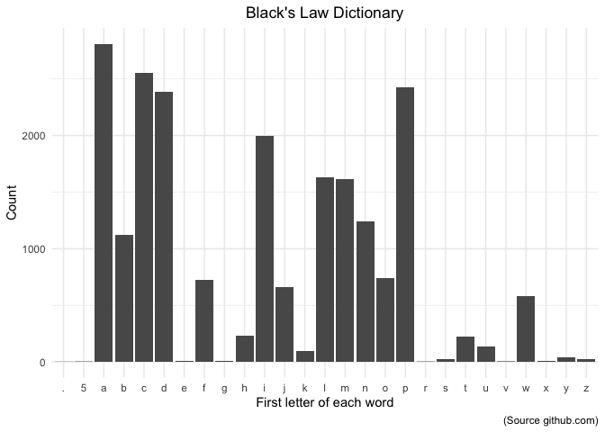
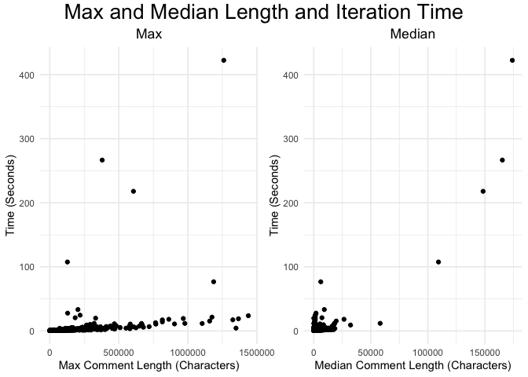
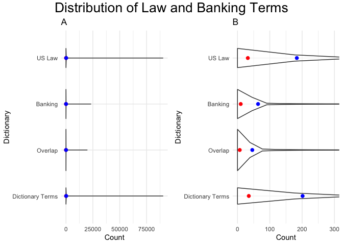
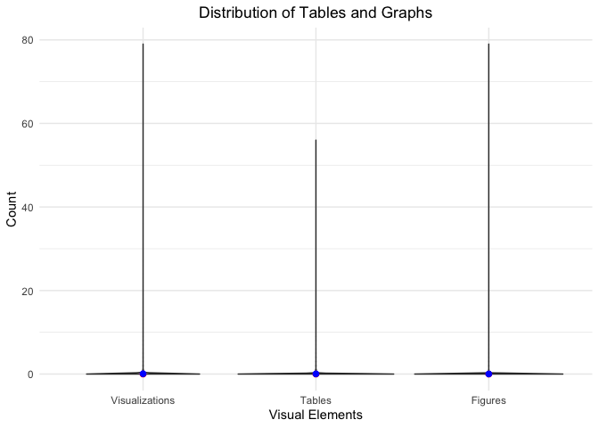
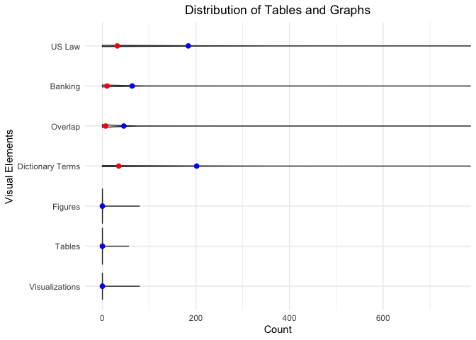

## Evaluating the Dictionaries

To show that commenters are using technical language, we need dictionaries for finance and legal terms.  For finance terms we use the [Oxford Dictionary of Finance and Banking](https://www.oxfordreference.com/view/10.1093/acref/9780199664931.001.0001/acref-9780199664931).  For law, we use the [Merriam Webster law dictionary](https://www.merriam-webster.com/browse/legal/).  While Black's is a more common law dictionary, a complete version is not available online.  I'll show in this section that the version of [Black's dictionary that exists on Github](https://github.com/nathanReitinger/Blacks8-Mac-Dictionary) is incomplete.  

### OED Finance Dictionary

The figure below takes the first letter of each word and plots them in a histogram.  This is a good test to see whether there are any missing letters or strange patterns to investigate.  There are 5260 terms.


```r
OED_Finance %>%
  mutate(first_letter = str_match(string = terms, pattern = "^.{1}")[,1],
         first_letter = tolower(first_letter)) %>%
  select(first_letter) %>%
  group_by(first_letter) %>%
  count(first_letter) %>% 
  ggplot(aes(x=first_letter, y = n)) +
  geom_col() +
  theme_minimal() +
  geom_col() +
  labs(title = "OED Finance Dictionary", 
       caption = "(Source https://www.oxfordreference.com/)") +
  theme(plot.title = element_text(hjust = 0.5)) +
  xlab("First letter of each word") + ylab("Count") 
```

<!-- -->


### Law Dictionaries: Merriam-Webster 

The code chunks below show histograms of the Merriam-Webster and Black's law dictionaries.  Note that although Blacks has 11133 more terms (Black's has 21305 and Merriam-Webster has 10172), Merriam-Webster is missing many fewer terms.


```r
MW_Law %>%
  rename(terms = ".") %>%
  mutate(first_letter = str_match(string = terms, pattern = "^.{1}")[,1],
         first_letter = tolower(first_letter)) %>%
  select(first_letter) %>%
  group_by(first_letter) %>%
  count(first_letter) %>% 
  ggplot(aes(x=first_letter, y = n)) +
  geom_col() +
  theme_minimal() +
  geom_col() +
  labs(title = "Merriam-Webster Law Dictionary", 
       caption = "(Source www.merriam-webster.com/browse/legal/)") +
  theme(plot.title = element_text(hjust = 0.5)) +
  xlab("First letter of each word") + ylab("Count") 
```

<!-- -->


```r
#' Github implementation of Black's law dictionary missing terms!
blacks_law_dict %>%  
  tibble() %>%
  rename(terms = ".") %>%
  mutate(first_letter = str_match(string = terms, pattern = "^.{1}")[,1],
         first_letter = tolower(first_letter)) %>%
  select(first_letter) %>%
  group_by(first_letter) %>%
  count(first_letter) %>% 
  ggplot(aes(x=first_letter, y = n)) +
  geom_col() +
  theme_minimal() +
  geom_col() +
  labs(title = "Black's Law Dictionary", 
       caption = "(Source github.com)") +
  theme(plot.title = element_text(hjust = 0.5)) +
  xlab("First letter of each word") + ylab("Count")
```

<!-- -->

## Law and Finance Overlap

There are 669terms that appear in both the law and banking dictionaries.  To prevent commenters from getting double credit for using these terms we put these terms in a separate dictionary and subtract the count from the sum of the law and banking terms.  That is, if a comment has 30 law and 50 banking terms but 10 are from the above list, we credit the commenter with 70 unique terms (30 + 50 - 10 as the 10 is counted in both the 30 and the 50).  

Below I show an example of the implementation of the dctionary using a sample of ten comments from each rule promulgated by the SEC from 1995-2020.  


```r
techincal_dict <- dictionary(list(UK_law = unlist(OED_Law[,1]),
                          banking = unlist(OED_Finance[,1]),
                          US_law = unlist(MW_Law[,1]),
                          Overlap = (banking_us_law_overlap)))

# problem, dataset is too big for dfm, so split into smaller sets 
num_groups = 1000
text_and_id <- attachments %>%
  select(attachment_text, comment_url) %>%
  distinct(comment_url, .keep_all = T) %>%
  group_by((row_number()-1) %/% (n()/num_groups)) %>%
  nest %>% pull(data)

technical_terms <- tibble()
iteration_stats <- tibble()

# issue https://www.regulations.gov/document/CFPB-2016-0025-199792 is 500 bundled
# comments.  so comes off highly in measures but not actually super sophisticated

for(i in 1:1000){
  
  cat(c(paste("On iteration ", i, " of 1,000")), sep = "\n")
  
  time.start = Sys.time()
  
  temp_text_ID_frame <- text_and_id[[i]]
  
  dictionary_corpus <- corpus(x = temp_text_ID_frame$attachment_text, docnames = temp_text_ID_frame$comment_url)  
  
  dictionary_dfm <- dictionary_corpus %>%
    tokens() %>%
    tokens_lookup(dictionary = techincal_dict ) %>%
    dfm() 
  
  technical_terms_temp <- convert(x = dictionary_dfm, to = "data.frame") %>%
    tibble() %>%
    mutate(dictionary_terms = banking + us_law - overlap)
  
  technical_terms <- technical_terms %>%
    dplyr::bind_rows(technical_terms_temp)
  
  #stats about distribution of length
  
  time.end = Sys.time()
  
  iteration_temp_stats <- unlist(lapply(X = temp_text_ID_frame$attachment_text, FUN = nchar)) %>%
    tibble() %>%
    summarise(n = length(temp_text_ID_frame$attachment_text),
            min = fivenum(.)[1],
            Q1 = fivenum(.)[2],
            median = fivenum(.)[3],
            Q3 = fivenum(.)[4],
            Q90 = quantile(., 0.9, na.rm = T),
            Q99 = quantile(., 0.99, na.rm = T),
            max = fivenum(.)[5]) %>%
    mutate(
      time = time.end - time.start,
      iteration = i 
    )

  iteration_stats <- iteration_stats %>%
    bind_rows(iteration_temp_stats)
}
save(technical_terms, iteration_stats, file = "/Users/stevenrashin/Documents/GitHub/Sophisticated_Commenters/tech_iterations.RData")
```

## Performance of Classifiers


```r
load("/Users/stevenrashin/Documents/GitHub/Sophisticated_Commenters/tech_iterations.RData")

max_length <- iteration_stats %>%
  ggplot(aes(x = max, y = time)) +
  geom_point() +
  theme_minimal() +
  labs(title = "Max") +
  theme(plot.title = element_text(hjust = 0.5)) +
  xlab("Max Comment Length (Characters)") + ylab("Time (Seconds)") 

median_length <- iteration_stats %>%
  ggplot(aes(x = median, y = time)) +
  geom_point() +
  theme_minimal() +
  labs(title = "Median") +
  theme(plot.title = element_text(hjust = 0.5)) +
  xlab("Median Comment Length (Characters)") + ylab("Time (Seconds)") 

grid.arrange(max_length, median_length, ncol = 2,
             top = textGrob("Max and Median Length and Iteration Time",gp=gpar(fontsize=20,font=1)))     
```

<!-- -->

In the tables below medians are in red and means are in blue.  


```r
#' Show Distribution of Technical Terms
#' Median is red, Mean is blue

Full <- technical_terms %>%
  select(-uk_law) %>%
  rename(Banking = banking,
         `US Law` = us_law,
         `Overlap` = overlap,
         `Dictionary Terms` = dictionary_terms) %>%
  gather(terms, val, -doc_id) %>%
  mutate(terms = factor(terms, levels=c("US Law", "Banking", "Overlap", "Dictionary Terms"))) %>%
  ggplot(aes(y=val, x=forcats::fct_rev(factor(terms)))) + 
  geom_violin(position="dodge", alpha=0.5) +
  theme_minimal() +
  coord_flip() +
  labs(title = "A") +
  #theme(plot.title = element_text(hjust = 0.5)) +
  xlab("Dictionary") + ylab("Count") +
  stat_summary(fun=median, geom="point", size=2, color="red") +
  stat_summary(fun=mean, geom="point", size=2, color ="blue")

Zoomed <- technical_terms %>%
  select(-uk_law) %>%
  rename(Banking = banking,
         `US Law` = us_law,
         `Overlap` = overlap,
         `Dictionary Terms` = dictionary_terms) %>%
  gather(terms, val, -doc_id) %>%
  mutate(terms = factor(terms, levels=c("US Law", "Banking", "Overlap", "Dictionary Terms"))) %>%
  ggplot(aes(y=val, x=forcats::fct_rev(factor(terms)))) + 
  geom_violin(position="dodge", alpha=0.5) +
  theme_minimal() +
  coord_flip(ylim = c(0, 300)) +
  labs(title = "B") +
  #theme(plot.title = element_text(hjust = 0.5)) +
  xlab("Dictionary") + ylab("Count") +
  stat_summary(fun=median, geom="point", size=2, color="red") +
  stat_summary(fun=mean, geom="point", size=2, color ="blue")


grid.arrange(Full, Zoomed, ncol = 2,
             top = textGrob("Distribution of Law and Banking Terms",gp=gpar(fontsize=20,font=1)))     
```

<!-- -->

The functions to count tables and figures are below.  The strings to instances function makes an adjustment for poorly formatted table numbering when OCR'd text shows a year or a page number after a figure (e.g., Figure 2015).  The function takes a sequence of numbers such as c(1, 2, 2015) and will see differences of 1 and 2013 between the terms and will throw out any number not within one of the previous number.  So in the example above, we have two tables, not three or 2015.


```r
#' Now we have technical terms, by doc_id 
#' Now do Figures and Tables
strings_to_instances <- function(unique_instances_in_order){
  # diff gives you vec length minus one length, so append true to front
  full_tf_vector <- c(T, !diff(unique_instances_in_order)!=1)
  
  # subset vector 
  modified_tf_in_order <- unique_instances_in_order[full_tf_vector]
  
  #' Get length (this picks up comments that only mention Figure 4 and 5 as 
  #' just having two figures)
  max_instances_number <- length(modified_tf_in_order)
  
  if(is.infinite(max_instances_number)){
    return("NON-NUMERICALLY-NAMED")
  } else {
    return( max_instances_number )
  }
  
  return(max_instances_number)
}

lookup_numbered_fcn <- function(txt, rgex){
  # problem_url = "https://www.sec.gov/rules/proposed/s71903/vsadana121603.txt"
  # rgex = "([Tt]able)\\s{1,}(\\w{1,}\\.{1}\\w{1,}|\\w{1,})" #"
  # txt = SEC_Comments_full[which(SEC_Comments_full$CommentID %in% problem_url),"text"]
  # txt = SEC_Comments_full$text[343]
  #txt = "Figure A1, Figure A2, Figure A3, Figure A14"
  #' get all non-appendix matches
  all_instances_numbered_normally <- stringr::str_extract_all(txt, rgex)[[1]]
  
  #' Get rid of the words "table" and "figure" so we can process the endings and get 
  #' rid of most of the non-tables
  all_instances_numbered_normally_wo_figure <- gsub(pattern = "[Ff]igure|[Ff]igures|[Tt]able|[Tt]ables", replacement = "", x = all_instances_numbered_normally)
  
  #' get rid of all entries whose figure numbers don't have an uppercase letter or digit
  #' i.e. get rid of things like "figure of" or "Figure below"
  #' So only take Figure A, Figure A
  
  likely_instances <- all_instances_numbered_normally[grepl(pattern = "\\d{1,}|[A-Z]{1,}", x = all_instances_numbered_normally_wo_figure)]
  
  # if no figures, return 0
  if(length(likely_instances) == 0){return(0)}
  
  #' If none, return 0 and move on
  #' If there are counts, deal with different types (i.e. A1, A.1, 1) and 
  #' suppose you have an incorrect number of figures (like figure 2015), 
  #' use diff function to take only documents with consecutive figure numbering
  #' also, length(diff) = length(vector) - 1, so add a true in the beginning
  
  #' If format is not covered, return an error
  covered_format <- F
  
  #' Has Appendix 
  has_appendix <- F
  
  #### count each separate type of figure and then add together at end ####
  total_digits <- 0
  total_digit_alpha <- 0 
  total_decimals <- 0
  total_alphabetical <- 0
  total_appendix <- 0
  
  # If number format is Figure 10
  if(any(grepl(pattern = "\\s{1,}\\d{1,}$", x = likely_instances)==T)){
    unique_instances_in_order <- unique(sort(as.numeric(stringr::str_match(string = likely_instances, pattern = "\\d{1,}"))))
    total_digits <- strings_to_instances(unique_instances_in_order)
    covered_format <- T
  }
  
  # If number format is figure 2A
  if(any(grepl(pattern = "\\s{1,}\\d{1,}[A-z]$", x = likely_instances)==T)){
    unique_instances_in_order <- unique(likely_instances[grepl(pattern = "\\s{1,}\\d{1,}[A-z]$", x = likely_instances)])
    total_digit_alpha <- length(unique_instances_in_order)
    covered_format <- T
  }
  
  #' If number format is xx.xx i.e. 4.1 
  #' Need to make sure 3.1 and 4.1 are different!
  if(any(grepl(pattern = "\\.", x = likely_instances) == T)){
    
    decimal_labels <- stringr::str_match(string = likely_instances, pattern = "\\d{1,}\\.\\d{1,}$")[,1]
    decimal_labels <- decimal_labels[!is.na(decimal_labels)]
    decimal_labels <- decimal_labels %>% unique()
    total_decimals <- length(decimal_labels)
    
    covered_format <- T
  } 
  
  # Alphabetically numbered figures (Figure AA to ZZ)
  if(any(grepl(pattern = "\\s{1,}[A-Z]{1,3}$", x = likely_instances) == T)){
    total_alphabetical <- length(unique(likely_instances))
    covered_format <- T
  }
  
  # If format has appendix
  if(any(grepl(pattern = "[A-z]\\d{1,}$", x = likely_instances)==T)){
    
    # Get appendix numbers
    appendix <- stringr::str_match(string = likely_instances, pattern = "[A-z](\\d{1,})")[,2]
    
    appendix_numbers <- appendix[!is.na(appendix)]
    
    appendix_numbers <- as.numeric(appendix_numbers)
    
    total_appendix <- strings_to_instances(sort(appendix_numbers))
    
    covered_format <- T
    has_appendix <- T
  }
  
  #' get rid of potential match if last word (i.e. corporate in "table Corporate")
  #' has more than 3 characters (i.e. there shouldn't be a table XYZA)
  if(all(grepl(pattern = "[A-z]{4,}$", x = likely_instances)==T)){
    return(0)
  }
  
  # If number format is Figure 
  if(covered_format == F){
    return(NA)
  } else {
    total_counted_objects <- total_digits + total_digit_alpha + total_decimals + total_alphabetical + total_appendix 
    return(total_counted_objects)
  }
} 
```


```r
#' Now we have technical terms, by doc_id 
#' Now do Figures and Tables

Tables_and_Figures <- attachments %>%
  mutate(figures = purrr::map2_dbl(.f = lookup_numbered_fcn, .x = attachment_text, .y = "([Ff]igure)\\s{1,}(\\w{1,}\\.{1}\\w{1,}|\\w{1,})"),
         tables  = purrr::map2_dbl(.f = lookup_numbered_fcn, .x = attachment_text, .y = "([Tt]able)\\s{1,}(\\w{1,}\\.{1}\\w{1,}|\\w{1,})")) %>%
  select(comment_url, figures, tables) %>%
  mutate(`Visualizations` = tables + figures)

#' Show Tables
Tables_and_Figures %>%
  rename(Figures = figures,
         Tables = tables) %>%
  gather(terms, val, -comment_url) %>%
  mutate(terms = factor(terms, levels=c("Figures", "Tables", "Visualizations"))) %>%
  ggplot(aes(y=val, x=forcats::fct_rev(factor(terms)))) + 
  geom_violin(position="dodge", alpha=0.5) +
  theme_minimal() +
  #coord_flip(ylim = c(0, 10)) +
  labs(title = "Distribution of Tables and Graphs") +
  theme(plot.title = element_text(hjust = 0.5)) +
  xlab("Visual Elements") + ylab("Count") +
  stat_summary(fun=median, geom="point", size=2, color="red") +
  stat_summary(fun=mean, geom="point", size=2, color ="blue")
```

<!-- -->

```r
#' Now Show Everything In One Plot
tech_in_one_column <- technical_terms %>%
  rename(comment_url = doc_id) %>%
  dplyr::inner_join(Tables_and_Figures, by ="comment_url") %>%
  rename(Banking = banking,
         `US Law` = us_law,
         `Overlap` = overlap,
         Figures = figures,
         Tables = tables,
         `Dictionary Terms` = dictionary_terms) %>%
  select(-uk_law) %>%
  gather(Technical_Features, val) %>%
  filter(Technical_Features != "comment_url") %>%
  mutate(val = as.double(val)) %>%
  group_by(Technical_Features) 
```


```r
#' Show summary statistics for all technical features
library(kableExtra)
tech_table <- tech_in_one_column %>%
  summarise(n = n(),
            min = fivenum(val)[1],
            Q1 = fivenum(val)[2],
            median = fivenum(val)[3],
            Q3 = fivenum(val)[4],
            Q90 = quantile(val, 0.9, na.rm = T),
            Q95 = quantile(val, 0.95, na.rm = T),
            Q99 = quantile(val, 0.99, na.rm = T),
            max = fivenum(val)[5])

knitr::kable(tech_table) %>%
  kable_styling(bootstrap_options = c("striped", "hover"))
```

<table class="table table-striped table-hover" style="margin-left: auto; margin-right: auto;">
 <thead>
  <tr>
   <th style="text-align:left;"> Technical_Features </th>
   <th style="text-align:right;"> n </th>
   <th style="text-align:right;"> min </th>
   <th style="text-align:right;"> Q1 </th>
   <th style="text-align:right;"> median </th>
   <th style="text-align:right;"> Q3 </th>
   <th style="text-align:right;"> Q90 </th>
   <th style="text-align:right;"> Q95 </th>
   <th style="text-align:right;"> Q99 </th>
   <th style="text-align:right;"> max </th>
  </tr>
 </thead>
<tbody>
  <tr>
   <td style="text-align:left;"> Banking </td>
   <td style="text-align:right;"> 88593 </td>
   <td style="text-align:right;"> 0 </td>
   <td style="text-align:right;"> 2 </td>
   <td style="text-align:right;"> 10 </td>
   <td style="text-align:right;"> 19 </td>
   <td style="text-align:right;"> 90 </td>
   <td style="text-align:right;"> 256.0 </td>
   <td style="text-align:right;"> 1149.16 </td>
   <td style="text-align:right;"> 23134 </td>
  </tr>
  <tr>
   <td style="text-align:left;"> Dictionary Terms </td>
   <td style="text-align:right;"> 88593 </td>
   <td style="text-align:right;"> 0 </td>
   <td style="text-align:right;"> 20 </td>
   <td style="text-align:right;"> 35 </td>
   <td style="text-align:right;"> 54 </td>
   <td style="text-align:right;"> 291 </td>
   <td style="text-align:right;"> 802.0 </td>
   <td style="text-align:right;"> 3471.08 </td>
   <td style="text-align:right;"> 90193 </td>
  </tr>
  <tr>
   <td style="text-align:left;"> Figures </td>
   <td style="text-align:right;"> 88593 </td>
   <td style="text-align:right;"> 0 </td>
   <td style="text-align:right;"> 0 </td>
   <td style="text-align:right;"> 0 </td>
   <td style="text-align:right;"> 0 </td>
   <td style="text-align:right;"> 0 </td>
   <td style="text-align:right;"> 0.0 </td>
   <td style="text-align:right;"> 0.00 </td>
   <td style="text-align:right;"> 79 </td>
  </tr>
  <tr>
   <td style="text-align:left;"> Overlap </td>
   <td style="text-align:right;"> 88593 </td>
   <td style="text-align:right;"> 0 </td>
   <td style="text-align:right;"> 0 </td>
   <td style="text-align:right;"> 7 </td>
   <td style="text-align:right;"> 13 </td>
   <td style="text-align:right;"> 65 </td>
   <td style="text-align:right;"> 180.0 </td>
   <td style="text-align:right;"> 836.00 </td>
   <td style="text-align:right;"> 19687 </td>
  </tr>
  <tr>
   <td style="text-align:left;"> Tables </td>
   <td style="text-align:right;"> 88593 </td>
   <td style="text-align:right;"> 0 </td>
   <td style="text-align:right;"> 0 </td>
   <td style="text-align:right;"> 0 </td>
   <td style="text-align:right;"> 0 </td>
   <td style="text-align:right;"> 0 </td>
   <td style="text-align:right;"> 0.0 </td>
   <td style="text-align:right;"> 1.00 </td>
   <td style="text-align:right;"> 56 </td>
  </tr>
  <tr>
   <td style="text-align:left;"> US Law </td>
   <td style="text-align:right;"> 88593 </td>
   <td style="text-align:right;"> 0 </td>
   <td style="text-align:right;"> 18 </td>
   <td style="text-align:right;"> 32 </td>
   <td style="text-align:right;"> 48 </td>
   <td style="text-align:right;"> 268 </td>
   <td style="text-align:right;"> 738.4 </td>
   <td style="text-align:right;"> 3184.24 </td>
   <td style="text-align:right;"> 90193 </td>
  </tr>
  <tr>
   <td style="text-align:left;"> Visualizations </td>
   <td style="text-align:right;"> 88593 </td>
   <td style="text-align:right;"> 0 </td>
   <td style="text-align:right;"> 0 </td>
   <td style="text-align:right;"> 0 </td>
   <td style="text-align:right;"> 0 </td>
   <td style="text-align:right;"> 0 </td>
   <td style="text-align:right;"> 0.0 </td>
   <td style="text-align:right;"> 1.00 </td>
   <td style="text-align:right;"> 79 </td>
  </tr>
</tbody>
</table>


```r
#' Show plot
tech_in_one_column %>%
  mutate(Technical_Features = factor(Technical_Features, levels=c("US Law", "Banking", "Overlap", "Dictionary Terms",
                                                     "Figures", "Tables", "Visualizations"))) %>%
  ggplot(aes(y=val, x=forcats::fct_rev(factor(Technical_Features)))) + 
  geom_violin(position="dodge", alpha=0.5) +
  theme_minimal() +
  coord_flip(ylim = c(0, 750)) +
  labs(title = "Distribution of Tables and Graphs") +
  theme(plot.title = element_text(hjust = 0.5)) +
  xlab("Visual Elements") + ylab("Count") +
  stat_summary(fun=median, geom="point", size=2, color="red") +
  stat_summary(fun=mean, geom="point", size=2, color ="blue")
```

<!-- -->
